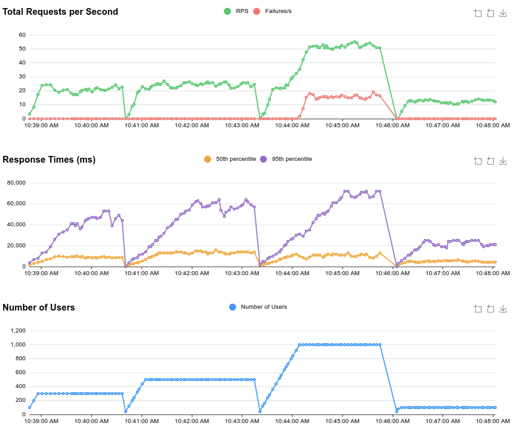
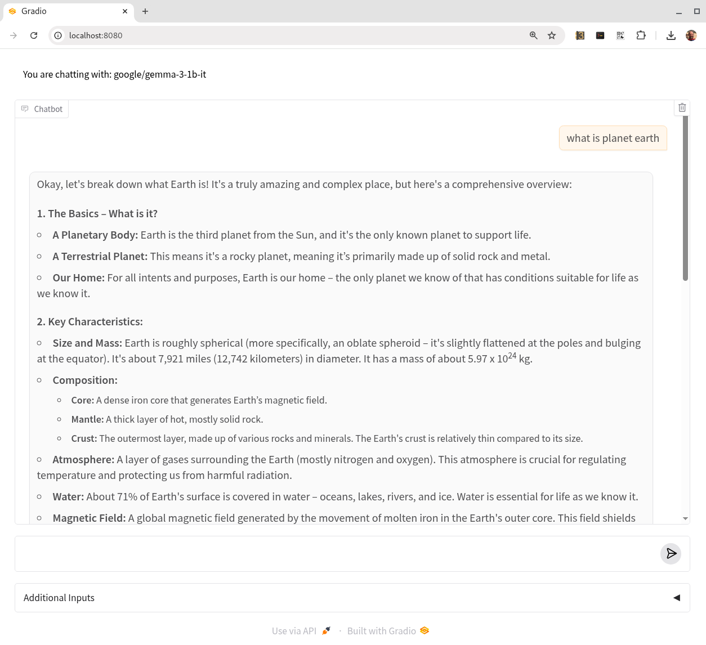

# Scalable deployments of LLMs under GKE

## Instructions

### Prerequisites

- Create or select a project
- Enable Kubernetes Engine API and GKE Enterprise
- Create a VPC named 'default', if it does not exist.  
- In IAM $\rightarrow$ Organizational policies edit the policy `constraints/compute.vmExternalIpAccess` and add a new rule **Allow all**
- In IAM $\rightarrow$ Service accounts create a default service account `<project_number>-compute@developer.gserviceaccount.com` with permissions `Kubernetes Engine Cluster Admin` and `Monitoring Admin` if it does not exist, or does not have such permissions.
- Accept licence of the model you want to deploy in Hugging Face and get an access token.
- Install locust load generator (`pip install locust`)

**NOTE**: These policies and configurations could be set more restrictive according to particular needs.

### Based on

- [Serve Gemma open models using GPUs on GKE with vLLM ](https://cloud.google.com/kubernetes-engine/docs/tutorials/serve-gemma-gpu-vllm)
- [Serve Gemma open models using GPUs on GKE with Hugging Face TGI](
https://cloud.google.com/kubernetes-engine/docs/tutorials/serve-gemma-gpu-tgi)
- [Optimize Pod autoscaling based on metrics](https://cloud.google.com/kubernetes-engine/docs/tutorials/autoscaling-metrics)
- [Custom Metrics - Stackdriver Adapter](https://github.com/GoogleCloudPlatform/k8s-stackdriver/blob/master/custom-metrics-stackdriver-adapter/README.md)

## Deploy

### 1. Deploy cluster

    > gcloud container clusters create-auto gemmacluster --project=gemma-test-deployment --region=us-central1 --release-channel=rapid
    > gcloud container clusters get-credentials gemmacluster --location=us-central1
    > kubectl create secret generic hf-secret --from-literal=hf_api_token=<YOUR_HF_TOKEN>

### 2. Select model

if you want to deploy Gemma v2, 

    cd gemma2

if you want to deploy Gemma v3

    cd gemma3

you could even deploy both as they are declared with different deployment and service names.

### 3. Deploy model  

    > alias k=kubeflow
    > k apply -f manifests/01_deployment.yaml
    > k apply -f manifests/02_perrmissions.yaml
    > k apply -f manifests/03_loadbalancer.yaml
    > k apply -f manifests/04_monitor.yaml 

### 4. Deploy autoscaling

    > k apply -f manifests/05-enable-custom-metrics.yaml

    > gcloud iam service-accounts add-iam-policy-binding --role \
         roles/iam.workloadIdentityUser --member \
         "serviceAccount:gemma-test-deployment.svc.id.goog[custom-metrics/custom-metrics-stackdriver-adapter]" \
         883536042426-compute@developer.gserviceaccount.com

    > kubectl annotate serviceaccount --namespace custom-metrics \
         custom-metrics-stackdriver-adapter \
         iam.gke.io/gcp-service-account=883536042426-compute@developer.gserviceaccount.com

    > k apply -f manifests/06-hpa.yaml

### 5. Deploy UI (optional)

    > k apply -f manifests/07-gradio.yaml
    > k port-forward service/gradio 8080:8080

and open your browser at localhost:8080

## Sanity checks

Check cluster is created

    > gcloud container clusters describe gemmacluster --zone=us-central1

After a few minutes you should see at least one pod on one node up and running

    > k get deployments,pods,nodes

    NAME                                   READY   UP-TO-DATE   AVAILABLE   AGE
    deployment.apps/tgi-gemma-deployment   1/1     1            1           26m

    NAME                                        READY   STATUS    RESTARTS   AGE
    pod/tgi-gemma-deployment-7d9f9dcd9d-t4rxv   1/1     Running   0          26m

    NAME                                           STATUS   ROLES    AGE   VERSION
    node/gk3-gemmacluster-nap-1bwi7nsq-ce6f4ef9-bdpr   Ready    <none>   31m   v1.32.2-gke.1182001
    node/gk3-gemmacluster-nap-1wr2jc8m-01e7233c-7btk   Ready    <none>   25m   v1.32.2-gke.1182001

Check pod is working (use the pod id you got above). You should get some text about WW2. It might take a few extra mins since the pod is running to start up the model server.

    > k port-forward pod/tgi-gemma-deployment-7d9f9dcd9d-t4rxv 8000:8000
    > python src/test.py http://localhost:8000

Check pod is keeping metrics. You should see a list of many metrics.

    > curl http://localhost:8000/metrics

Check pod monitoring is scraping the metrics. You should see some information about a recent last scrape.

    > k describe podmonitoring

Check external access is working. Use the external IP from the following command

    > k get services 

    NAME            TYPE           CLUSTER-IP       EXTERNAL-IP     PORT(S)          AGE
    gemma-service   LoadBalancer   34.118.229.199   35.224.145.17   8000:31481/TCP   46m
    kubernetes      ClusterIP      34.118.224.1     <none>          443/TCP          62m

    > python src/test.py http://35.224.145.17:8000

Generate a load and observe model serving performance

- edit `src/locust.conf`, set your external IP above and `users=50` (or some number you want to test)
- run 

   `> locust --config src/locust.conf`

- open http://localhost:8089 in a browser and click on the charts tab. You should see requests per second and latency (response times)

- you can also run the following command in another shell to monitor gpu performance and metrics while doing the load test.

    `> python src/monitor.py --endpoint http://35.224.145.17:8000 --metrics tgi_queue_size,tgi_request_count,tgi_request_success`

You should also see metrics at: https://console.cloud.google.com/monitoring/metrics-explorer

Check custom metrics services are ok. You should see `v1beta1.custom.metrics.k8s.io` with the availability flag set to `true`

    k get apiservices

Check horizontal pod autoscaler (HPA) is able to monitor the metrics. You should see messages like _the HPA was able to successfully calculate a replica count from pods metric_

    k decribe hpa

Increase the load for HPA to kick off. Edit `src/locust.config` and set `users=500` and run

    locust --config src/locust.conf 

Open http://localhost:8089 in a browser and click on the charts tab. 

Run pods gpus monitoring command

    > python src/monitor.py --endpoint http://35.224.145.17:8000 --metrics tgi_queue_size,tgi_request_count,tgi_request_success

